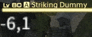
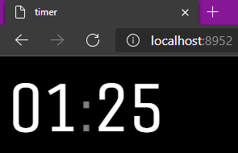
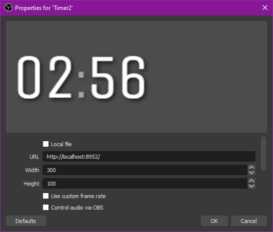

# EngageTimer

**Help translating** : https://crwd.in/engagetimer

Finally, display all the numbers when starting a countdown!

**Main features :**

- Big countdown that displays all the numbers
- Customizable big-number textures (default, yellow, WoW style or custom files)
- Floating window with combat timer and countdown
- OBS browser-source compatible page

This is a plugin for the [FFXIV plugin platform Dalamud](https://github.com/goatcorp/FFXIVQuickLauncher).

The original motivation for this plugin was to do something like
["Acurate Countdown" plugin by Haplo064](https://github.com/Haplo064/Europe)
but with a big stopwatch timer for my recordings.

*Living on the edge ? You can add my testing repository : https://plogon.xorus.dev/*

## Countdown

Adds the missing numbers in the standard countdown thing!


This examples showcases the bundled number styles with the hide original timer option enabled.

You can also enable the "ticking" sound if you want.

### Make your own number textures

Select `Custom` as Style in the settings for Big Countdown and set your own texture folder !

**Requirements:**

- Images must be PNG
- Files must be names from 0.png to 9.png
- Images can be any width
- Images will top-aligned, so I recommend using the same height for all numbers

[More details](Data/numbers/README.md)

[Download example custom textures](Doc/custom_example.zip)

## Stopwatch



Super simple combat timer you can place anywhere on your screen with optional tenths of seconds for some kinds of nerds.
Kinda customizable.

It can also display countdowns in a more precise manner.

## OBS overlay

The plugin lets you enable a web server that can be used to display your current timer information in a more accurate
way.

Alternatively you can access this web page from another device and see the timer thing.



In OBS as a browser source :



You can easily change the font by adding something like this in the *Custom CSS* in the OBS browser source settings:

```css
body {
    font-family: "Comic Sans MS";
}
```

The timer page was designed to be as simple as possible for easily overriding with custom styles in OBS. But I could
implement a way to customize it in the plugin GUI if someone needs that.

## Other things I need to say

I have based myself on the work of ["Acurate Countdown" plugin by Haplo064](https://github.com/Haplo064/Europe)
for the countdown pointer and on the [Peeping Tom plugin by asclemens](https://git.sr.ht/~jkcclemens/PeepingTom) for the
idea of using NAudio lib to play the sound.

Smooth font size was adapted from ["Ping Plugin" by karashiiro](https://github.com/karashiiro/PingPlugin)

---------

[](https://ko-fi.com/T6T26N988)
